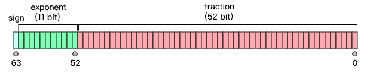

# 浮点数

## 浮点数的存储结构
浮点数的表示借鉴了`科学计数法`
浮点数的储存结构被分为：`符号位S、指数位E、尾数位M`
公式为：
$
N=\left( -1\right) ^{S}\times M\times 2^{E}
$
 

例子：
十进制|二进制|二进制科学计数法|S|E|M
---|---|---|---|---|---|
23.0|10111|1.0111*2^4|0|4|1.0111|

可以看出`指数位E决定了可表示的数的范围`、`尾数位决定了浮点数的精度`，

## 双精度浮点数
js采用的`IEEE754双精度64位`来表示浮点数

- 第63位为`符号位S`，0表示正数，1表示负数
- 第52-63位为`指数位E`，取值范围为2^11=2048,但是指数部分有正有负，所以取中值1023，指数取值为`E-1023`
- 第0-51位为`尾数位M`，取zhi

## 参考文章
[浮点数的底层原理和精度损失问题](https://zhuanlan.zhihu.com/p/269619376)
[浮点数字还原](https://www.binaryconvert.com/result_double.html?decimal=057057046053053)