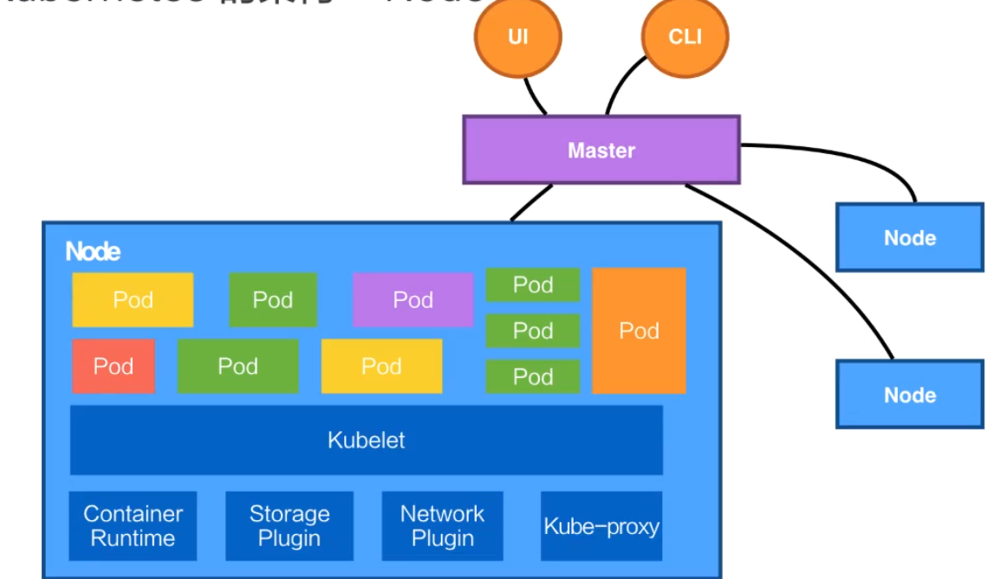

# Kubernetes
自动化的容器编排平台
文档地址 ：https://kubernetes.io/zh/docs/setup/production-environment/tools/kubeadm/install-kubeadm/

## 核心功能
- 服务发现、负载均衡
- 自动发布与回滚
- 容器自动装箱
。。。

### 调度
把服务部署到空闲的机器

### 自动恢复
节点健康检查 => 迁移到别的机器

### 水平伸缩
集群中 A负载过高 => 自动部署到集群中的其他机器 => 开启负载均衡


## 架构


解析：Kubernetes 架构是一个比较典型的二层架构和 server-client 架构。master作为中间管控节点，与Node进行连接，所有UI 的、clients、这些 user 侧的组件，只会和 Master 进行连接

### Master架构
#### API Server
处理API操作
#### Controller
对容器进行扩容、修复，都是由Controller进行
#### Scheduler
调度器，把用户提交的一个Container，根据对CPU、对memory等需求，找到一台合适的节点进行放置
#### etcd
是一个分布式的一个存储系统,API Server 中所需要的这些原信息都被放置在 etcd 中

### Node架构


## 核心概念
### Pod
- 最小的调度以及资源单元
- 一个或者多个容器组成
- 定义容器的运行方式
- 提供给容器共享的运行环境（网络、进程空间）

### Volume
- 声明在Pod中的容器可以访问的文件目录
- 支持多种后端存储抽象
  - 本地存储、分布式存储、云存储等

### Deployment
- 定义一组Pod的副本数量、版本等
- 通过控制器维持Pod数量
  - 自动恢复失败Pod

### Service
- 提供访问一个或者多个Pod实例的稳定访问地址
- 支持多种访问实现
  - ClusterIP

### Namespace
- 一个集群内部的逻辑隔离机制（鉴权）

## API基础
使用json/yaml
```
apiVesion: v1
kind: Pod
metadata: 
  name: nginx
  labels:
    name: nginx
spec:  // pod中包含的容器的描述
  containers:
  - name: nginx
    image: nginx
    ports: 
    - containerPort: 80
```

### Label
- 一组key:Value
- 可以被selector所查询
  - select color = red
- 资源集合的默认表达形式
  - Service对应的一组Pod